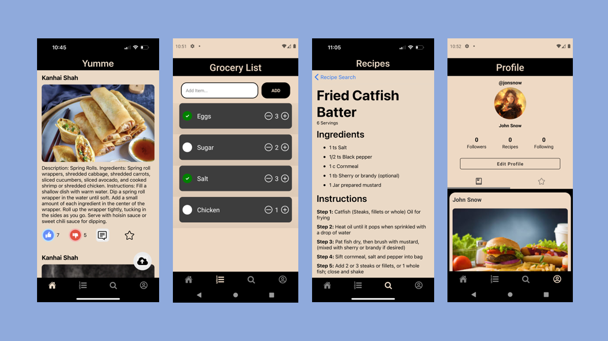
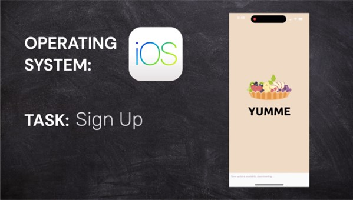

<h1 align="center">
  YUMME
  <h4 align="center">A recipe recommendation app.</h4>

 <a href="#demo-video">Demo</a> •
  <a href="#key-features">Key Features</a>

 

 

## Demo Video
Click the image below to view the demo video.

## Key Features

- <b>Firebase Authentication</b>
  - Email verification is used to authenticate new users and during the password reset process
      
- <b>Recipe Social Media Feed</b>
  - Users can post, rate, comment and save recipes
      
- <b>Grocery List</b>
  - Users can add or delete ingredients from the grocery list
      
- <b>Recipe Search</b>
  - Users can search for new recipes using the Recipe API created by <a href="https://api-ninjas.com/api/recipe">API Ninjas</a>
      
- <b>Cross platform</b>
  - Android and iOS ready.

 
